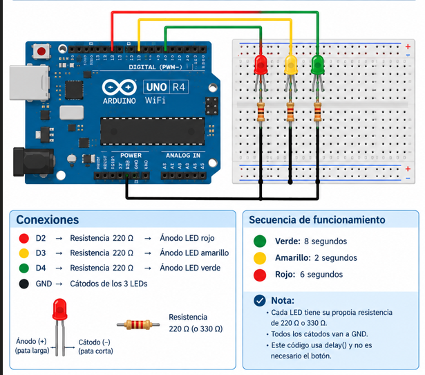

# delay() - millis(): Control de Temporización en Arduino

## Descripción

Esta práctica tiene como propósito comparar dos formas de manejar la temporización en Arduino: la función `delay()` y la función `millis()`, mediante el control de un conjunto de tres LEDs (rojo, amarillo y verde) programado en Arduino UNO R4 WiFi.

Se implementaron dos versiones del mismo circuito: una utilizando `delay()`, que bloquea la ejecución del programa mientras espera, y otra utilizando `millis()`, que permite mantener el programa en ejecución sin detenerse mientras se cumple cada intervalo de tiempo.

## Objetivos

* Comprender la diferencia entre temporización bloqueante y no bloqueante.
* Implementar el control de tres LEDs utilizando `delay()`.
* Implementar el mismo control utilizando `millis()`.
* Identificar ventajas y limitaciones de cada método.
* Sentar las bases para el manejo de eventos externos sin bloquear el programa.

## Herramientas y material utilizado

* Arduino UNO R4 WiFi.
* Arduino IDE.
* Protoboard.
* LED rojo.
* LED amarillo.
* LED verde.
* Resistencias limitadoras de corriente (220–330 Ω).
* Cables de conexión (jumpers).

## Diagrama

El diagrama muestra las conexiones utilizadas para el control de los tres LEDs.

[Ver carpeta Diagramas](Diagramas)

## Código

Se incluyen dos versiones del programa: una con `delay()` y otra con `millis()`, ambas con la misma secuencia de tiempos (verde 8 s, amarillo 2 s, rojo 6 s).

[Ver código con delay()](codigos/delay.ino)

[Ver código con millis()](codigos/milis.ino)

## Reporte

El reporte contiene la explicación del funcionamiento de ambas versiones, el análisis comparativo entre `delay()` y `millis()`, y las conclusiones obtenidas durante la práctica.

[Ver Reporte](reporte/Reporte_delay_millis.pdf)

## Resultados

Ambas versiones del programa reprodujeron correctamente la secuencia de encendido de los LEDs con los tiempos programados. En la versión con `delay()` se comprobó que el programa queda completamente detenido durante cada pausa, sin poder atender ninguna otra tarea. En la versión con `millis()` se comprobó que el programa continúa ejecutándose en todo momento, comparando el tiempo transcurrido en cada vuelta del `loop()` sin dejar de estar disponible para otras operaciones.

Esta comparación permitió evidenciar de forma práctica por qué `millis()` es la opción recomendada cuando el sistema debe reaccionar a eventos externos, como botones o sensores.

## Video

El video muestra el funcionamiento de ambas versiones del circuito y la diferencia de comportamiento entre `delay()` y `millis()`.

[Ver video millis](https://youtube.com/shorts/SLzMT97ppjg?si=EJtjsvkn1-rs28xF)

[Ver video delay](https://youtube.com/shorts/1iwWOfG87Y0?feature=share)

[Ver carpeta Video](videos)

## Conclusiones

La práctica permitió comparar de forma directa dos enfoques distintos para manejar la temporización en Arduino. Se comprobó que `delay()` es sencillo de implementar pero bloquea por completo la ejecución del programa, mientras que `millis()` requiere una lógica ligeramente más compleja (variables de estado y comparación de tiempos) a cambio de mantener el programa siempre activo y capaz de responder a otros eventos.

En conjunto, esta práctica sentó las bases necesarias para implementar sistemas más complejos, como máquinas de estados finitos con entradas externas, donde el uso de `millis()` resulta indispensable.
